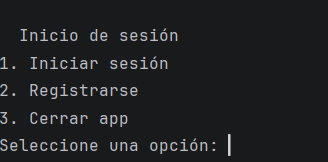
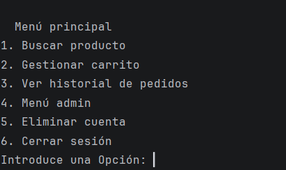
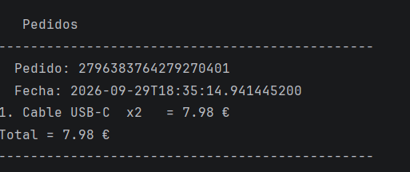
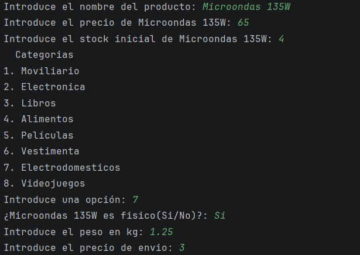
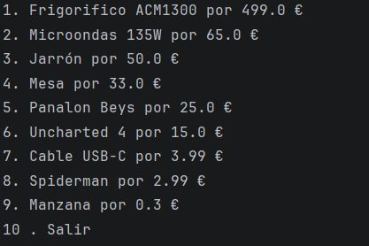
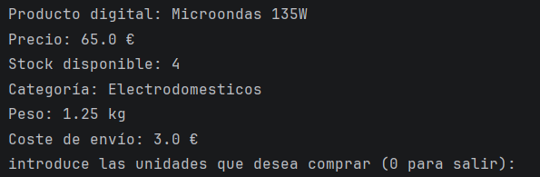
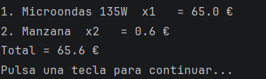
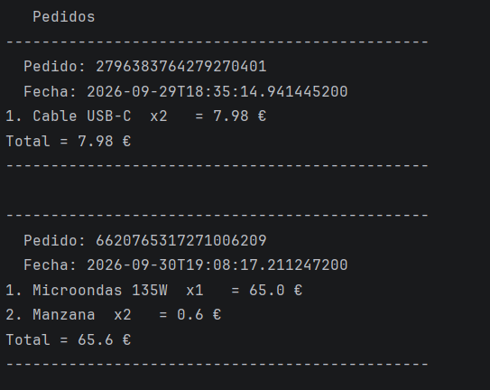
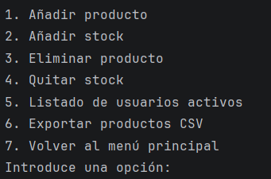

# Decisiones de diseño y estilo

## 1. Enfoque visual general

El proyecto utiliza una **interfaz de consola de carácter funcional**, diseñada para que las distintas operaciones de una pequeña aplicación de comercio electrónico puedan realizarse mediante menús textuales.

La decisión principal de diseño es priorizar:

- **Claridad de las opciones** frente a elementos gráficos decorativos.
- **Navegación secuencial**, mediante menús numerados.
- **Mensajes directos** para indicar qué debe introducir el usuario.
- **Separación visual mediante espacios y líneas**, aprovechando el formato de texto de la consola.
- Una presentación sencilla y homogénea en todas las pantallas.

No se utilizan componentes gráficos, iconos, imágenes ni elementos visuales complejos. La propia consola actúa como superficie de interfaz.

---

## 2. Estructura visual y navegación

La interfaz se organiza jerárquicamente mediante **menús principales y submenús**.

El flujo visual comienza en la pantalla de inicio de sesión, donde se presentan tres acciones claramente diferenciadas:

1. Iniciar sesión.
2. Registrarse.
3. Cerrar la aplicación.

Una vez dentro de la aplicación, el usuario accede a un **menú principal**. Las opciones disponibles cambian ligeramente según se trate de un usuario normal o de un administrador, evitando mostrar opciones administrativas a usuarios que no las necesitan.

Esta estructura busca que cada pantalla tenga un conjunto reducido de acciones y que el usuario avance por niveles:

> Inicio → Menú principal → Función → Resultado → Regreso al menú.



---

## 3. Uso de menús numerados

La interacción se basa en opciones precedidas por números, por ejemplo:

```text
1. Buscar producto
2. Gestionar carrito
3. Ver historial de pedidos
4. Eliminar cuenta
5. Cerrar sesión
```

Este formato se utiliza de manera consistente en prácticamente toda la aplicación.

### Motivos de diseño

- Permite identificar rápidamente las acciones disponibles.
- Evita depender de comandos que el usuario tenga que memorizar.
- Facilita la navegación mediante teclado.
- Mantiene una estructura visual sencilla.
- Hace que los submenús mantengan el mismo patrón que el menú principal.

Los menús administrativos siguen exactamente esta filosofía, ampliando las opciones cuando el usuario dispone de permisos de administración.



---

## 4. Jerarquía visual mediante texto

Al no existir una interfaz gráfica, la jerarquía se construye mediante:

- Títulos escritos directamente en consola.
- Saltos de línea.
- Numeración de opciones.
- Líneas horizontales para separar información.
- Mensajes breves antes de solicitar datos.
- Listados numerados para seleccionar productos.

Por ejemplo, los pedidos utilizan una separación visual mediante guiones:

```text
-----------------------------------------------
  Pedido: ...
  Fecha: ...
  ...
-----------------------------------------------
```

Esto permite distinguir visualmente un pedido del siguiente sin necesidad de componentes gráficos.



---

## 5. Limpieza de pantalla

La clase de utilidades incorpora una estrategia específica para mantener limpia la consola.

En lugar de dejar todas las pantallas anteriores visibles, se imprimen múltiples saltos de línea para generar una sensación de **cambio de pantalla**.

Esta decisión hace que:

- Los menús no se acumulen indefinidamente.
- El contenido actual tenga mayor protagonismo.
- Las operaciones consecutivas sean más fáciles de seguir.
- La experiencia se aproxime a una navegación entre pantallas aunque la aplicación sea completamente textual.

La limpieza se combina además con pausas mediante mensajes como:

```text
Pulsa una tecla para continuar...
```

De esta forma, el resultado de una operación permanece visible el tiempo suficiente para que pueda ser leído antes de mostrar la siguiente pantalla.

---

## 6. Mensajes e interacción con el usuario

Los textos de interacción siguen un estilo **directo e imperativo**.

Al solicitar información se utilizan mensajes como:

```text
Introduce el email:
Introduce la contraseña:
Introduce el nombre del producto:
Selecciona un producto:
```

El objetivo es que el usuario sepa inmediatamente qué dato debe proporcionar.

Los mensajes de resultado también son breves:

- `Producto añadido con exito`
- `Producto eliminado`
- `Stock actualizado`
- `Compra realizada con exito`
- `Operación cancelada`

Esta brevedad evita sobrecargar una interfaz que, por su propia naturaleza, ya depende principalmente del texto.

---

## 7. Tratamiento visual de errores

Los errores se comunican mediante mensajes textuales inmediatamente después de la acción que los provoca.

Algunos ejemplos son:

```text
Opción no existente
Producto no encontrado
Stock insuficiente para su pedido
Número no válido...
Respuesta no válida...
```

La aplicación mantiene así una relación directa entre:

**acción → resultado → mensaje**

En lugar de utilizar pantallas de error independientes, el mensaje aparece dentro del mismo flujo de navegación.

Esto reduce la complejidad de la interfaz y evita que el usuario tenga que interpretar estados visuales adicionales.

---

## 8. Formularios y entrada de datos

La introducción de datos se realiza siempre mediante una pregunta textual seguida de la entrada del usuario.

La interfaz reutiliza un patrón común para las peticiones:

```text
Mensaje de la aplicación: [entrada del usuario]
```

Además, existen funciones específicas para solicitar:

- Texto.
- Números enteros.
- Números decimales.
- Respuestas booleanas.

Esta separación permite que cada tipo de dato tenga un comportamiento de entrada coherente.

En los valores numéricos se contempla incluso la sustitución de `,` por `.` para los decimales, haciendo que la introducción de precios resulte más natural para un usuario acostumbrado al formato decimal español.



---

## 9. Selección de productos

Los productos se presentan como **listas numeradas**, mostrando únicamente la información necesaria para realizar una primera selección:

```text
1. Producto A por 10.0 €
2. Producto B por 25.5 €
3. Producto C por 40.0 €
4. Salir
```

La decisión de mostrar inicialmente nombre y precio permite comparar rápidamente varias opciones sin saturar la pantalla.

Cuando el usuario selecciona un producto, se muestra una segunda capa de información con los detalles específicos del producto.

Este patrón establece una jerarquía:

1. **Lista resumida** para localizar un producto.
2. **Detalle ampliado** para decidir la compra.



---

## 10. Presentación diferenciada de productos

El modelo de productos distingue entre productos físicos y digitales.

La información presentada al comprar se adapta a cada tipo.

### Producto físico

Se muestran datos como:

- Nombre.
- Precio.
- Stock disponible.
- Categoría.
- Peso.
- Coste de envío.

### Producto digital

Se muestran:

- Nombre.
- Precio.
- Stock disponible.
- Categoría.
- Tamaño.
- Licencia.

Esta decisión evita presentar atributos irrelevantes. La interfaz utiliza la misma estructura general, pero cambia el contenido específico según la naturaleza del producto.



---

## 11. Organización del carrito

El carrito utiliza una presentación basada en líneas de producto:

```text
1. Producto A  x2   = 20.0 €
2. Producto B  x1   = 15.0 €
Total = 35.0 €
```

La información está organizada en tres niveles:

- **Número de línea** para identificar el producto.
- **Cantidad y subtotal** para cada elemento.
- **Total** al final.

El total se coloca después de todos los productos para crear un cierre visual claro del resumen de compra.

Cuando no existen productos, se utiliza directamente:

```text
No hay productos
```

De esta forma, el estado vacío del carrito también tiene una representación explícita.



---

## 12. Historial de pedidos

Cada pedido se visualiza como un bloque independiente.

La separación mediante líneas horizontales permite distinguir fácilmente:

- Identificador del pedido.
- Fecha.
- Productos incluidos.
- Total correspondiente al carrito.

La decisión de utilizar bloques separados resulta especialmente útil cuando existen varios pedidos, ya que evita que la información de diferentes compras se mezcle visualmente.



---

## 13. Menú administrativo

La interfaz administrativa conserva el mismo lenguaje visual que el resto de la aplicación.

Las operaciones de administración se presentan mediante un menú numerado:

```text
1. Añadir producto
2. Añadir stock
3. Eliminar producto
4. Quitar stock
5. Listado de usuarios activos
6. Exportar productos CSV
7. Volver al menú principal
```

No se introduce una apariencia visual diferente para el administrador. La diferenciación se realiza principalmente mediante **las opciones disponibles**, manteniendo la coherencia de la interfaz.

Esto evita crear dos estilos visuales distintos dentro de la misma aplicación.



---

## 14. Categorías como selección cerrada

La selección de categorías también sigue un menú numerado:

```text
1. Moviliario
2. Electronica
3. Libros
4. Alimentos
5. Películas
6. Vestimenta
7. Electrodomesticos
8. Videojuegos
```

En lugar de pedir al usuario que escriba libremente una categoría, se presentan opciones predeterminadas.

Desde el punto de vista de usabilidad, esta decisión reduce:

- Errores ortográficos.
- Variaciones en los nombres.
- Valores inesperados.
- Inconsistencias entre productos.

---

## 15. Confirmaciones y cancelaciones

Las acciones potencialmente destructivas utilizan una confirmación explícita.

Por ejemplo, antes de eliminar una cuenta se solicita:

```text
¿Estas seguro no podras recuperar la cuenta?
```

También se contempla el uso de palabras como `salir` o `cancelar` en determinadas operaciones.

El objetivo es proporcionar una salida sencilla de las operaciones y evitar que el usuario tenga que completar un formulario cuando ya no desea continuar.

---


## 19. Consistencia visual

Uno de los principios más claros del diseño es la reutilización de patrones.

Las diferentes áreas de la aplicación —productos, carrito, administración, pedidos y autenticación— mantienen:

- Menús numerados.
- Preguntas directas.
- Mensajes breves.
- Pausas antes de continuar.
- Limpieza de pantalla.
- Opciones explícitas para volver atrás.
- Mensajes de error integrados en el flujo.

Esta consistencia reduce el esfuerzo necesario para aprender a utilizar las diferentes partes de la aplicación.

---

## 20. Filosofía de diseño

En conjunto, la interfaz sigue una filosofía **simple, funcional y orientada a la interacción por teclado**.

Las decisiones visuales priorizan:

- **Simplicidad:** no se utilizan elementos gráficos innecesarios.
- **Consistencia:** los menús y mensajes mantienen patrones repetidos.
- **Legibilidad:** se utilizan espacios, saltos de línea y separadores.
- **Control del usuario:** las operaciones ofrecen opciones explícitas para cancelar o volver.
- **Información progresiva:** primero se muestra un resumen y después el detalle cuando es necesario.
- **Feedback inmediato:** las operaciones muestran un mensaje indicando su resultado.

El resultado es una interfaz deliberadamente minimalista, coherente con una aplicación de consola y centrada en que las operaciones de compra, gestión de productos y administración sean fáciles de localizar y seguir visualmente.

---

## 21. Extras elegidos

Para este proyecto he seleccionado 3 extras

**Persistencia alternativa**: guardando todos los datos en ficheros.

**Sistema de roles**: habiendo usuarios administradores qe pueden acceder al menú admin y usuarios normales los cuales no tienen acceso.

**Posibilidad de exportar productos a excel**:Para poder tener los productos mas visuales

